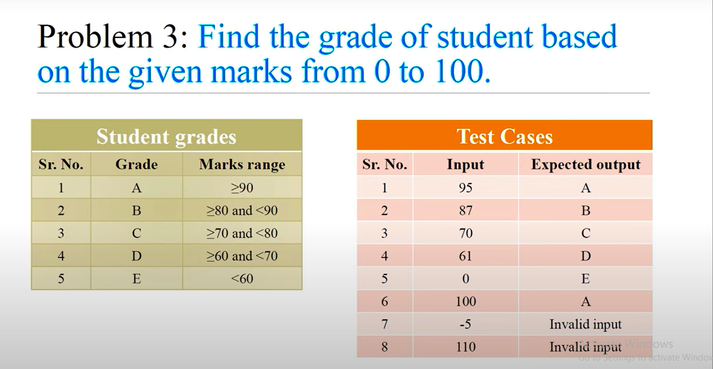

mark=int(input("Enter the mark:"))

if mark<0 or mark >100:
    print("invalid")
elif mark>100:
    print("A")
elif mark>90:
    print("B")
elif mark >80:
    print("c")
elif mark>70:
    print("D")
elif mark>60:
    print("e")

else:
    print("invalid ")